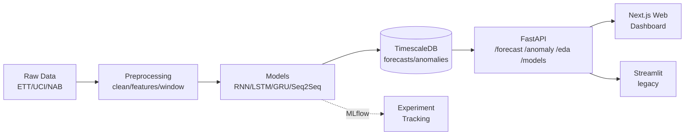

# ⚡ GridPulse — End-to-End Time-Series Intelligence Platform

Forecasting, missing-data imputation, and anomaly detection on energy/sensor
time series, built around RNN-family models (RNN/LSTM/GRU/Seq2Seq) with a full
production stack: FastAPI + TimescaleDB + a Next.js web dashboard (plus a legacy
Streamlit app), containerized with Docker.


## 🎬 Demo

[screenshot của dashboard — Forecasting page]
[screenshot của Anomaly page]

## 🏗️ Architecture



## ✨ Features

- **Forecasting** — RNN/LSTM/GRU/Seq2Seq vs classical baselines, multi-horizon (1–48h)
- **Imputation** — 6 methods (ForwardFill → MICE → BiLSTM) with mask-and-recover eval
- **Anomaly Detection** — residual-based scoring, dynamic thresholding, event grouping
- **Production stack** — REST API, time-series DB, interactive dashboard, all Dockerized

## 🚀 Quick Start

```bash
git clone https://github.com/EugeneAndTheMachine/gridpulse-rnn-timeseries
cd gridpulse-rnn-timeseries
cp .env.example .env
make demo          # starts DB + API + dashboard, seeds data
```

Then open:
- Web dashboard (Next.js) → http://localhost:3000
- API docs → http://localhost:8000/docs
- Streamlit (legacy) → http://localhost:8501

### Web dashboard (local dev)

The modern dashboard lives in `apps/web` (Next.js + React + Tailwind, white/green
theme). With the API running on `:8000`:

```bash
cd apps/web
npm install
npm run dev            # http://localhost:3000
```

Or from the repo root: `make web-dev` (dev server) / `make web-build`
(production build). Point it at a non-default API with `NEXT_PUBLIC_API_URL`.
Pages: Overview · Data & EDA · Forecasting · Model Comparison · Imputation.

The dashboard needs stored forecasts to populate the Forecasting and Model
Comparison pages — run `make seed` (or `scripts/backfill_forecasts.py`) after
the stack is up.

## 📊 Key Results

[bảng benchmark chính từ notebooks]

## 🧱 Tech Stack

| Layer | Technology |
|---|---|
| Modeling | PyTorch, PyTorch Lightning |
| Experiment tracking | MLflow |
| API | FastAPI, Pydantic v2 |
| Database | TimescaleDB, SQLAlchemy 2.0, Alembic |
| Web dashboard | Next.js 14, React 18, TypeScript, Tailwind CSS, Recharts |
| Legacy dashboard | Streamlit, Plotly |
| Packaging | uv |
| Infra | Docker Compose, GitHub Actions |

## 📁 Project Structure

[cây thư mục rút gọn]

## 🧪 Testing

```bash
make test                    # unit tests
uv run pytest -m integration # DB/API integration (needs running DB)
```

33 tests across forecasting, imputation, anomaly, DB, and API layers.

## 📈 Research Notebooks

[link các notebooks + mô tả ngắn]

## 📝 License

MIT